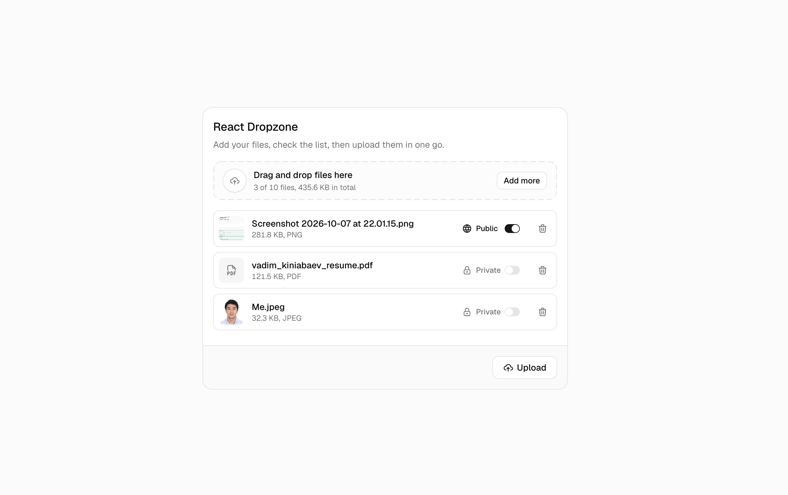
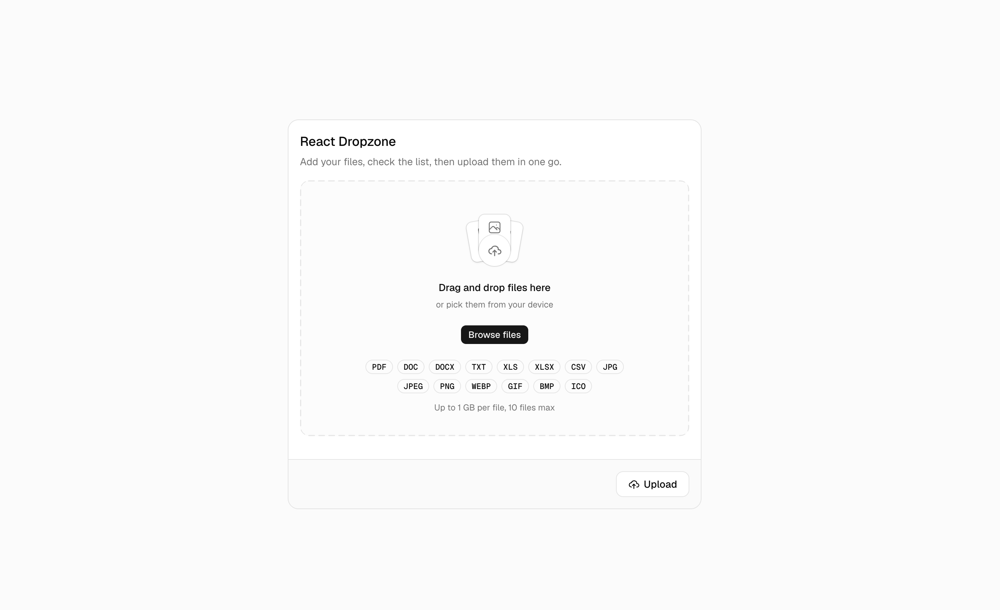
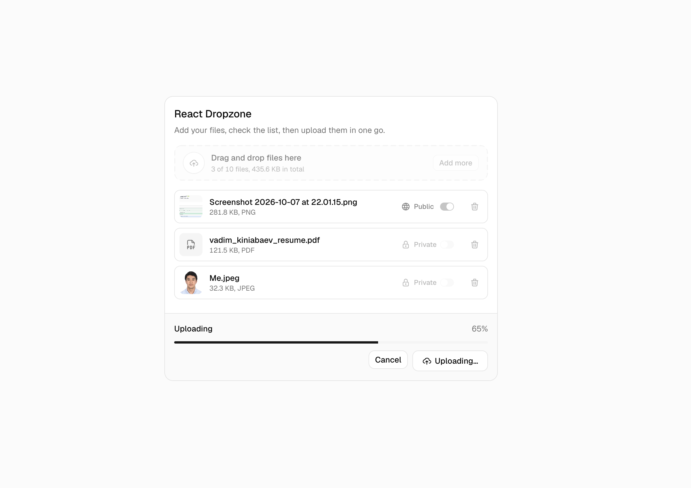
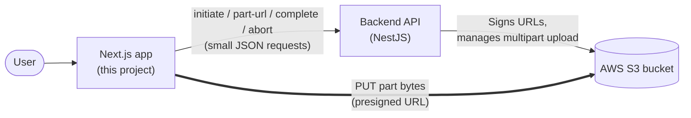
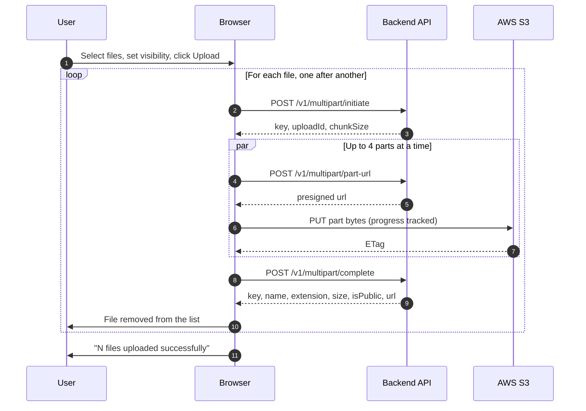
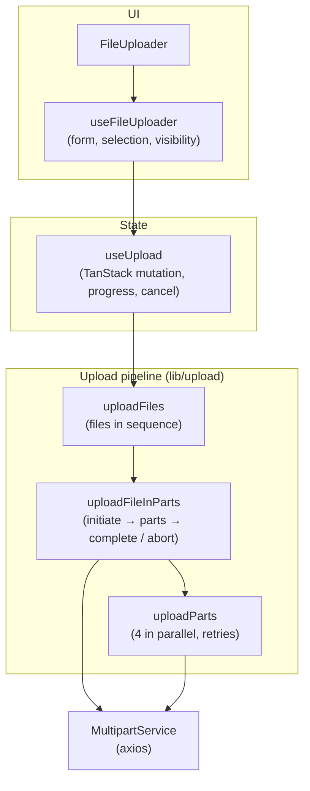

<div align="center">

# S3 Multipart Upload — Frontend

**A resilient drag-and-drop uploader for large files, built with Next.js.**

Files are split into parts and sent from the browser straight to AWS S3,
in parallel and with automatic retries. The backend only signs the requests.

[](https://nextjs.org)
[](https://react.dev)
[](https://www.typescriptlang.org)
[](https://tanstack.com/query)
[](https://tailwindcss.com)
[](https://zod.dev)

</div>



## Backend Repository

[Github Repository](https://github.com/thekinv21/AWS_MultipartFileUpload_BE)

## Overview

This is the client for the [AWS S3 Multipart Upload API](../aws_file_upload). It lets users pick files, decide per file whether it should be public or private, and upload everything in one go with a single progress bar.

Large uploads in the browser fail in predictable ways: connections drop, tabs are closed, a single slow request blocks everything. The uploader is built around those failure modes:

| Problem                              | How the uploader handles it                                             |
| ------------------------------------ | ----------------------------------------------------------------------- |
| One large request is fragile         | Files are split into parts using the `chunkSize` from the backend       |
| Uploads are slow over one connection | 4 parts are uploaded in parallel                                        |
| Networks drop or throttle            | Each part is retried up to 3 times with exponential backoff             |
| The user changes their mind          | Cancel stops all requests and aborts the upload on S3                   |
| Invalid files waste time             | Type, size, count, name length and duplicates are checked before upload |
| Credentials must stay private        | The browser only ever sees short-lived presigned URLs                   |

## Highlights

**File selection**

- Drag and drop or "Browse files", powered by `react-dropzone`.
- Validation on add: allowed type (extension and MIME type together), maximum size, maximum file count, file name length, and duplicate detection.
- A clear notification for every rejected file, explaining why.
- Thumbnails for images and type icons for documents.

**Upload pipeline**

- Chunked multipart upload directly to S3 through presigned URLs.
- Parallel part uploads (4 at a time) with order-preserving results.
- Automatic retries for network errors, `429` and `5xx`, with backoff of 1 s and 2 s.
- Byte-accurate overall progress across all files; retried bytes are never counted twice.
- Cancel at any time; unfinished uploads are cleaned up on S3.

**Visibility**

- Every file starts as **private**; nothing becomes public without an explicit choice.
- A per-file switch marks files as **public**, which gives them a permanent URL.

**Feedback**

- Success, failure and cancellation notifications.
- Partial success reporting: if a file fails, files completed before it are removed from the list and the user is told how many made it.

## Screenshots

|                               Empty state                               |
| :---------------------------------------------------------------------: |
|  |
|                         **Upload in progress**                          |
|   |

## Architecture

### System overview



### Upload sequence



If a part still fails after its retries, or the user cancels, the remaining parts are stopped and `POST /v1/multipart/abort` cleans up the upload on S3.

### Code layers



UI components never call the API directly. The pipeline functions are plain TypeScript, independent of React, which keeps the upload logic easy to read and test in isolation.

## Quick start

### Prerequisites

- [Bun](https://bun.sh) 1.x
- A running [backend](../aws_file_upload) (default `http://localhost:4200`)
- S3 bucket CORS that allows this app's origin and exposes the `ETag` header (see the backend's [AWS setup](../aws_file_upload/README.md#aws-setup))

### Install and run

```bash
bun install
cp .env.example .env
bun run dev
```

Open [http://localhost:3000](http://localhost:3000).

## Configuration

All variables are validated with Zod when the app loads; an invalid value stops the app with a clear message. See [`.env.example`](.env.example) for a template.

| Variable                           | Required | Default in example          | Description                                    |
| ---------------------------------- | :------: | --------------------------- | ---------------------------------------------- |
| `NEXT_PUBLIC_API_URL`              |    ✓     | `http://localhost:4200/api` | Backend base URL, including the `/api` prefix. |
| `NEXT_PUBLIC_FILE_MAX_SIZE_BYTES`  |    ✓     | `1073741824`                | Maximum size of one file (1 GiB).              |
| `NEXT_PUBLIC_FILE_MAX_COUNT`       |    ✓     | `10`                        | Maximum number of files selected at once.      |
| `NEXT_PUBLIC_FILE_MAX_NAME_LENGTH` |    ✓     | `255`                       | Maximum file name length.                      |

> [!NOTE]
> Keep the size and name length limits in sync with `AWS_FILE_MAX_SIZE_BYTES` and `AWS_FILE_MAX_NAME_LENGTH` on the backend, and the allowed file types in [`src/constants/FileConstant.ts`](src/constants/FileConstant.ts) in sync with the backend list. These checks give users instant feedback; the backend enforces the real limits.

### Tuning the upload pipeline

The pipeline constants live in [`src/lib/upload/MultipartParts.ts`](src/lib/upload/MultipartParts.ts):

| Constant                   | Default | Effect                                       |
| -------------------------- | ------- | -------------------------------------------- |
| `PART_CONCURRENCY`         | `4`     | Parts uploaded at the same time per file     |
| `PART_RETRY_ATTEMPTS`      | `3`     | Total attempts per part, including the first |
| `PART_RETRY_BASE_DELAY_MS` | `1000`  | First retry delay; doubles on every attempt  |

The part size itself is not configured here. It comes from the backend in the `chunkSize` field of the initiate response.

## Integration

### Service API

[`MultipartService`](src/services/multipart/MultipartService.ts) wraps every backend endpoint and is exported as the `multipartService` singleton:

| Method                          | Endpoint                                                       |
| ------------------------------- | -------------------------------------------------------------- |
| `initiateMultipartUpload(body)` | `POST /v1/multipart/initiate`                                  |
| `getPresignedPartUrl(body)`     | `POST /v1/multipart/part-url`                                  |
| `uploadPart(url, chunk)`        | `PUT <presigned url>` directly to S3, bypassing the API client |
| `completeMultipartUpload(body)` | `POST /v1/multipart/complete`                                  |
| `abortMultipartUpload(body)`    | `POST /v1/multipart/abort`                                     |
| `getDownloadUrl({ key })`       | `GET /v1/multipart/download-url`                               |

### Using the upload result

Each completed file returns:

```json
{
	"key": "uploads/public/0f6c2f0e-...-mountain-sunset.png",
	"name": "mountain-sunset.png",
	"extension": "png",
	"size": 108277,
	"isPublic": true,
	"url": "https://<bucket>.s3.<region>.amazonaws.com/uploads/public/0f6c2f0e-...-mountain-sunset.png"
}
```

The backend does not store this result. It is passed to the `onFileUploaded` callback of `useUpload`, which is the place to save it to your own system:

```ts
const upload = useUpload({
	onFileUploaded: (file, uploaded) => {
		// uploaded: { key, name, extension, size, isPublic, url }
		saveToMyApi(uploaded)
	},
})
```

For private files `url` is `null`. Request a time-limited link when the user wants to download:

```ts
const url = await multipartService.getDownloadUrl({ key: uploaded.key })
window.location.assign(url)
```

## Reliability

| Behaviour                 | Detail                                                                                                                                                                                         |
| ------------------------- | ---------------------------------------------------------------------------------------------------------------------------------------------------------------------------------------------- |
| **Retry policy**          | [`isRetryableRequestError`](src/services/instance/errorCatch.ts) retries network errors without a response, `429` and `5xx`. Other `4xx` responses and cancellations fail immediately.         |
| **Progress accuracy**     | A retried part restarts its progress from zero, so bytes from a failed attempt are not counted and the percentage never exceeds 100 %.                                                         |
| **Fail fast**             | When one part fails for good, the remaining parts of that file are aborted instead of finishing in vain.                                                                                       |
| **Cleanup**               | Any failure or cancel before completion calls `abort`, so no orphaned parts stay on S3.                                                                                                        |
| **Initiate and complete** | Both ignore the cancel signal on purpose: initiate must return an `uploadId` so a cancel can be cleaned up, and once complete starts the file is stored and must not be reported as cancelled. |
| **Navigation**            | Leaving the page is not treated as a user cancel, so no "cancelled" notification is shown.                                                                                                     |

## Project structure

```
app/
├── layout.tsx                    # Root layout, fonts, providers
└── page.tsx                      # Home page
src/
├── components/
│   ├── file-upload/              # Uploader feature
│   │   ├── FileUploader.tsx      # Card, progress bar, Upload / Cancel
│   │   ├── useFileUploader.ts    # Form, add / remove files, submit
│   │   ├── useSelectedFiles.ts   # Selected files and their visibility
│   │   ├── FileDropzone.tsx      # Drag-and-drop area
│   │   ├── FileList.tsx          # List of selected files
│   │   ├── FileListItem.tsx      # One file row
│   │   ├── FileVisibilityToggle.tsx
│   │   └── dropzone/             # Dropzone building blocks
│   └── ui/                       # Shared UI primitives (button, card, switch, toast, ...)
├── config/                       # Env schema and validation
├── constants/                    # Limits, allowed types, user-facing messages
├── hooks/
│   ├── useUpload.ts              # Upload mutation, progress, cancel, notifications
│   └── useAbortController.ts
├── lib/
│   ├── upload/                   # Upload pipeline (framework independent)
│   │   ├── UploadFiles.ts        # Sequential files, overall progress
│   │   ├── MultipartUpload.ts    # One file: initiate → parts → complete / abort
│   │   └── MultipartParts.ts     # Parallel parts with retries
│   ├── FileUtils.ts              # Validation, chunking, formatting
│   ├── PromiseUtils.ts           # mapWithConcurrency, withRetry
│   ├── ProgressUtils.ts
│   └── UploadNotifications.ts
├── providers/                    # TanStack Query client and toaster
├── services/
│   ├── instance/                 # axios instance, error helpers, retry policy
│   └── multipart/                # MultipartService
└── types/multipart/              # Request and response types
```

## Scripts

| Command                | Description                  |
| ---------------------- | ---------------------------- |
| `bun run dev`          | Start the development server |
| `bun run build`        | Create a production build    |
| `bun run start`        | Serve the production build   |
| `bun run lint`         | Lint with ESLint             |
| `bun run format`       | Format sources with Prettier |
| `bun run format:check` | Verify formatting            |
